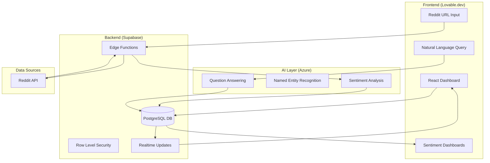

# BurnBook 🔥

A PM-focused Reddit sentiment dashboard that helps ImageTrend product managers analyze customer sentiment from Reddit posts. Built with Lovable.dev, Supabase, and Azure AI.

## ⚡ Deploy in 90 Seconds

1. **Clone & Import to Lovable.dev**
   ```bash
   git clone https://github.com/yourusername/BurnBook.git
   ```
   - Go to [Lovable.dev](https://lovable.dev)
   - Import this repository
   - Click "Deploy"

2. **Set up Supabase**
   - Create a new project at [supabase.com](https://supabase.com)
   - Run the SQL seed script (see below)
   - Copy your project URL and anon key

3. **Configure Azure AI**
   - Create an Azure AI Language resource
   - Get your endpoint and API key
   - Deploy the edge function (see below)

## 🏗️ Architecture



## 🚀 Features

- **📥 Reddit URL Ingestion**: Paste any Reddit URL to automatically fetch and analyze posts
- **📊 Sentiment Dashboards**: View sentiment breakdowns by:
  - Company
  - Product
  - Feature
- **💬 Natural Language Queries**: Ask questions like "What do users think about our mobile app?"
- **⚡ Real-time Updates**: Dashboard updates automatically as new data is ingested
- **🔓 Demo Mode**: No authentication required for quick testing

## 📋 Prerequisites

- Node.js 18+
- Supabase account (free tier works)
- Azure AI Language service (free tier available)
- Lovable.dev account

## 🔧 Step-by-Step Setup

### Step 1: Supabase Setup

1. Create a new Supabase project at [supabase.com](https://supabase.com)
2. Navigate to the SQL Editor
3. Run the SQL seed script from `supabase/migrations/001_initial_schema.sql`

### Step 2: Environment Configuration

Create a `.env.local` file:

```env
VITE_SUPABASE_URL=your_supabase_project_url
VITE_SUPABASE_ANON_KEY=your_supabase_anon_key
VITE_AZURE_AI_ENDPOINT=your_azure_ai_endpoint
VITE_AZURE_AI_KEY=your_azure_ai_key
```

### Step 3: Deploy Edge Function

```bash
# Install Supabase CLI
npm install -g supabase

# Login and link your project
supabase login
supabase link --project-ref your-project-ref

# Deploy the sentiment analysis function
supabase functions deploy analyze-sentiment
```

### Step 4: Local Development

```bash
# Install dependencies
npm install

# Start development server
npm run dev
```

### Step 5: Deploy to Lovable.dev

1. Push your code to GitHub
2. Import the repository in Lovable.dev
3. Add environment variables in the Lovable.dev dashboard
4. Click "Deploy"

## 📁 Project Structure

```
BurnBook/
├── src/
│   ├── components/       # React components
│   │   ├── RedditUrlInput.tsx
│   │   ├── SentimentDashboard.tsx
│   │   ├── NaturalLanguageQuery.tsx
│   │   └── SentimentChart.tsx
│   ├── pages/           # Page components
│   │   └── Dashboard.tsx
│   ├── lib/             # Utility functions
│   │   ├── supabase.ts
│   │   └── azure-ai.ts
│   ├── hooks/           # Custom React hooks
│   │   └── useSentiment.ts
│   └── types/           # TypeScript types
│       └── index.ts
├── supabase/
│   ├── functions/       # Edge functions
│   │   └── analyze-sentiment/
│   └── migrations/      # SQL migrations
│       └── 001_initial_schema.sql
├── public/              # Static assets
└── docs/                # Documentation
```

## 🗄️ Database Schema

See `supabase/migrations/001_initial_schema.sql` for the complete schema including:
- `reddit_posts`: Stores ingested Reddit posts
- `sentiment_analysis`: Stores AI sentiment results
- `entities`: Stores extracted companies, products, features
- `queries`: Stores natural language query history

## 🔌 API Reference

### Ingest Reddit URL

```typescript
const { data, error } = await supabase.functions.invoke('analyze-sentiment', {
  body: { url: 'https://reddit.com/r/example/...' }
});
```

### Query Sentiment Data

```typescript
const { data, error } = await supabase
  .from('sentiment_analysis')
  .select('*')
  .eq('entity_type', 'product');
```

### Natural Language Query

```typescript
const { data, error } = await supabase.functions.invoke('nl-query', {
  body: { question: 'What do users think about feature X?' }
});
```

## 🧪 Testing

```bash
# Run unit tests
npm test

# Run E2E tests
npm run test:e2e
```

## 📄 License

MIT License - see LICENSE file for details.

## 🤝 Contributing

1. Fork the repository
2. Create a feature branch
3. Make your changes
4. Submit a pull request

---

Built with ❤️ for Product Managers who want to understand their users better.
